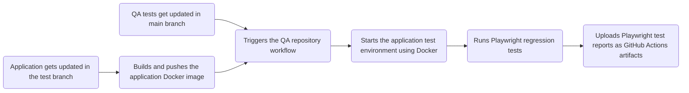

# Automation Strategy

## Test Framework
- Playwright
- TypeScript

## Browser Coverage
Automated regression tests are executed against:
- Chromium
- Firefox
- WebKit

## Covered Flow
The automated suite covers the critical RSVP workflow and regression scenarios:

Landing Page
→ Guest Search
→ RSVP Form
→ Submission
→ Success Page

## Covered Scenarios

The following scenarios are automated:

- LP-01: User opens the landing page
- LP-02: User clicks RSVP button
- RS-01: User accesses the guest search page
- RS-02: User searches for a valid guest
- RS-03: User searches for a non-existing guest
- RS-04: User submits empty search form
- RS-05: User accesses already-submitted guest
- FM-01: User submits a new RSVP
- FM-02: User submits without required fields
- FM-03: User manages accompanying guests
- FM-04: User updates existing RSVP

## Test Approach

The automated suite focuses on high-value functional regression coverage, including:

- Critical user journeys
- Form validation
- RSVP creation and update flows
- Data persistence verification

## CI Execution

This project uses GitHub Actions to automatically execute Playwright E2E tests.

The CI pipeline flow:

## Test Reports

Playwright HTML reports are uploaded as GitHub Actions artifacts after each CI run.

Test reports include:
- HTML test reports
- JUnit XML reports
- Screenshots for failed tests
- Docker logs for failed tests
- Trace files for debugging when tests fail or get retries